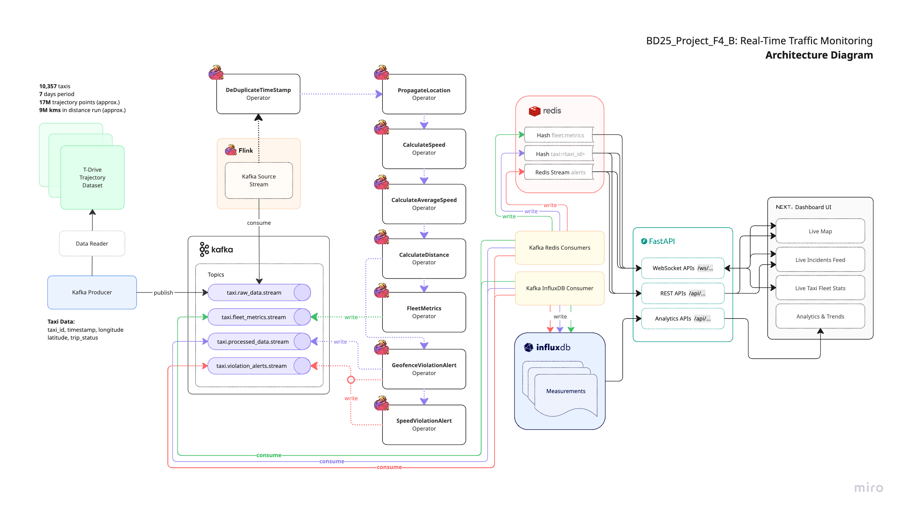

######  Real-Time Traffic Monitoring


## 📌 Project Overview

This project implements a real-time monitoring dashboard for a taxi fleet using Big Data technologies. It uses the [T-Drive Trajectory Dataset](https://www.microsoft.com/en-us/research/publication/t-drive-trajectory-data-sample/), which contains one-week trajectories of 10,357 taxis in Forbidden City, Beijing in China. The total number of points in this dataset is about 17 million and the total distance of the trajectories reaches 9 million kilometers.

The system processes live taxi location data through a stream processing topology that includes filtering and aggregation steps. The raw location data is replayed and fed into Apache Kafka, which acts as the data source. Apache Flink processes this data to generate meaningful insights, and Redis is used for fast data caching. A FastAPI backend serves the processed data to a modern live dashboard built with Next.js. The system is containerized and orchestrated using Docker Compose for easy deployment.


## 🔗 Demo Servers

- Primary Server: http://34.40.51.225:3000/home
- Secondary Server: http://34.40.9.0:3000/home


##  🛠️ System Architecture


## ✅ System Requirements

These ensure smooth performance when running multiple services via Docker:

- Operating System: Linux, macOS, or Windows with WSL2 (recommended for Docker performance)
- RAM: Minimum 8 GB (Recommended: 12 GB+)
- Disk Space: At least 5 GB free (for Docker images, logs, etc.)
- CPU: Multi-core processor (4+ cores recommended)
- Internet Connection: Required initially to pull Docker images

## 🧰 Prerequisites

Before you begin, ensure you have the following installed:

- [Docker](https://www.docker.com/get-started)
- [Docker Compose](https://docs.docker.com/compose/)
- **Windows Users**: Install [WSL2](https://docs.microsoft.com/en-us/windows/wsl/install) and [Docker Desktop](https://docs.docker.com/desktop/install/windows-install/) with WSL2 integration. Run all commands from WSL terminal, not PowerShell.

## 🚀 Steps to Run the Project

#### 1. Clone the Repository

```bash
git clone https://collaborating.tuhh.de/e-19/teaching/bd25_project_f4_b
cd bd25_project_f4_b
```

#### 2. Verify Configuration

After cloning the repository, check the `.env` file in the project root directory to ensure all configurations are correct.

#### 3. Deploy the Project Stack

Use the automated deployment script to check prerequisites, pull images, and start all services:

```bash
./deploy.sh
```

The deployment script will:
- Check Docker and Docker Compose installation
- Validate docker-compose.yaml configuration
- Pull all required Docker images with `docker compose pull`
- Start all services with `docker compose up -d`
- Display container status and service URLs
- Show helpful monitoring commands

#### 4. Monitor the Deployment

The deployment script will show you:
- **Container Status**: All running containers and their health
- **Service URLs**: Direct links to all dashboards
- **Helpful Commands**: Log monitoring and troubleshooting commands

To monitor logs in real-time:
```bash
docker compose logs -f
```

To check specific service logs:
```bash
docker compose logs -f <service-name>
```

#### 5. View the Dashboards

Access all dashboards:

- **Real-Time Traffic Monitoring Dashboard** - [http://localhost:3000](http://localhost:3000)
    

    

    

- **Apache Kafka UI Dashboard** - [http://localhost:8088](http://localhost:8088)

    
- **Apache Flink Dashboard** - [http://localhost:8081](http://localhost:8081)

    

- **InfluxDB Dashboard** - [http://localhost:8086](http://localhost:8086)
    

> **Tip:** All services are automatically health-checked. If any dashboard is not accessible, check the deployment logs or restart the specific service.

#### 6. Cleanup

Use the automated cleanup script to stop services and optionally remove data:

**Basic cleanup (preserves data):**
```bash
./cleanup.sh
```

**Full cleanup with confirmation prompts (removes all data and images):**
```bash
./cleanup.sh --all
```

**Cleanup options:**
- `./cleanup.sh --volumes` - Remove data volumes
- `./cleanup.sh --images` - Remove Docker images to save space
- `./cleanup.sh --networks` - Remove Docker networks
- `./cleanup.sh --force` - Skip confirmation prompts

### Pipeline Performance Optimization Report

You can find the pipeline perrformance optimization report [here](docs/FLINK_PIPELINE_OPTIMIZATION_REPORT.md).

### Getting Docker Images for Running Project Stack
> **Note:** The `./deploy.sh` script will automatically pull these images during deployment. You only need to manually pull them if you encounter issues or prefer to pre-fetch the images.

To manually pull all the required Docker images for the project stack from DockerHub, follow the steps below:

1. Ensure Docker is installed and running on your system.
2. Open a terminal or command prompt.
3. Use the `docker pull` command to fetch each image by specifying the image name and tag.

Here are the commands to pull the necessary Docker images:

```bash
docker pull shinushaju/bd25_project_f4_b-dashboard-ui:latest
docker pull shinushaju/bd25_project_f4_b-pyflink:1.18.1
docker pull shinushaju/bd25_project_f4_b-fastapi-backend-apis:latest
docker pull shinushaju/bd25_project_f4_b-kafka-influxdb-consumer:latest
docker pull shinushaju/bd25_project_f4_b-kafka-redis-consumer:latest
docker pull shinushaju/bd25_project_f4_b-kafka-producer:latest
```

Once all images are pulled, you can proceed with the deployment steps outlined above.

