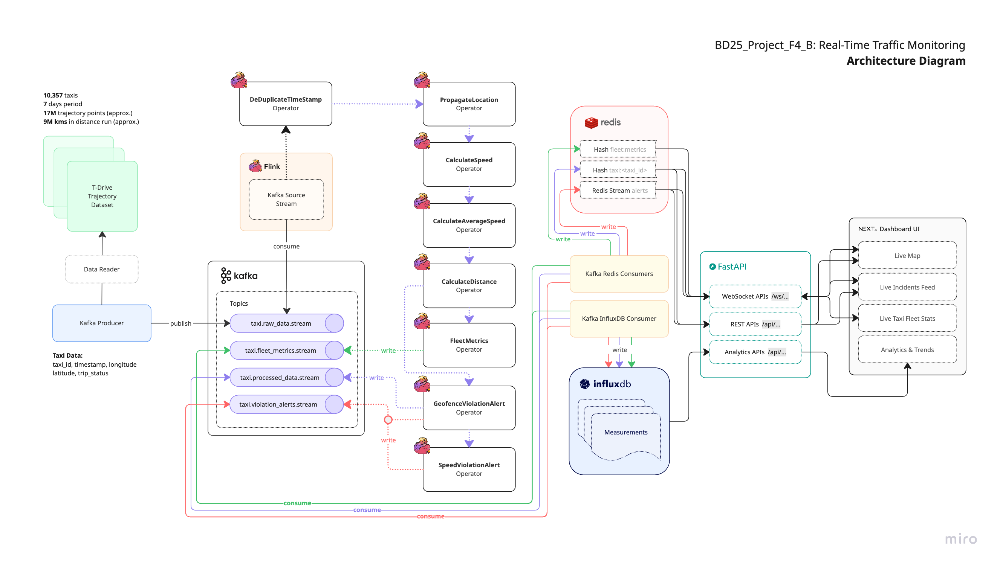
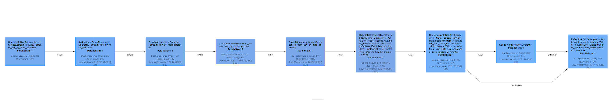
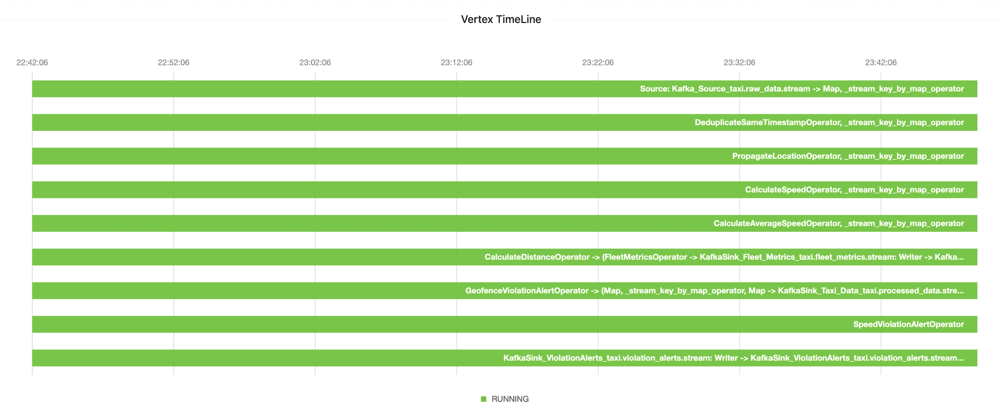
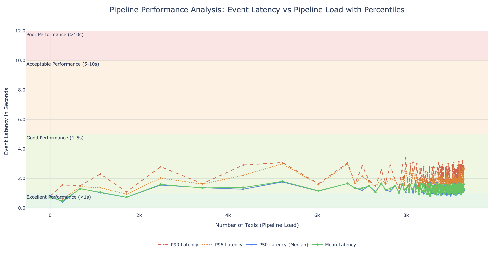
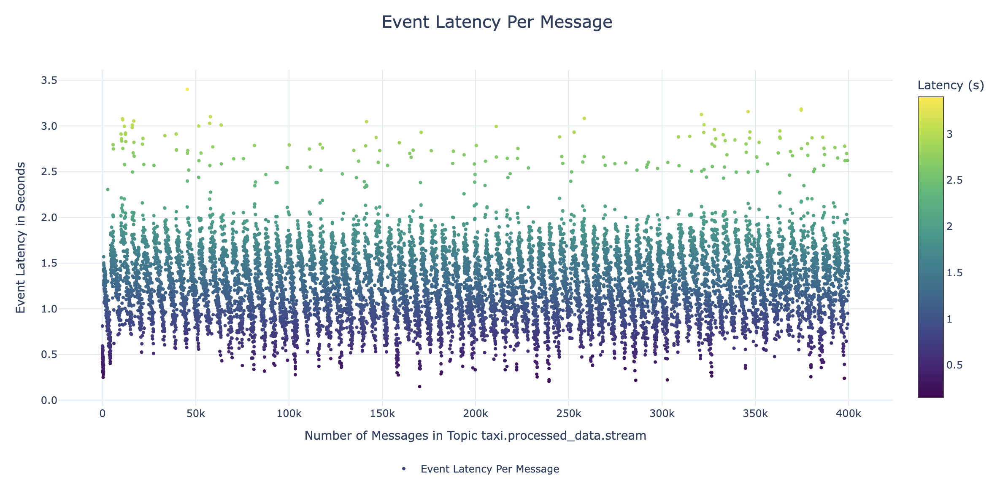
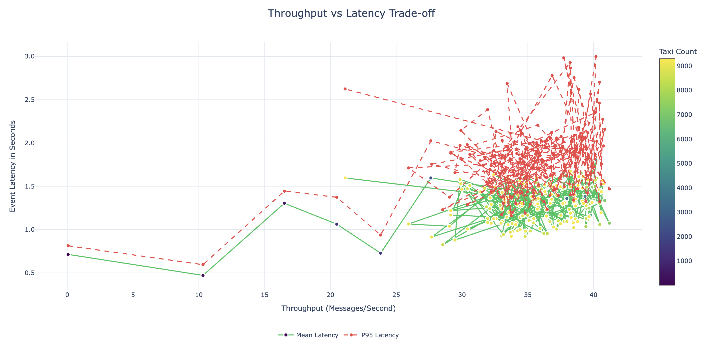
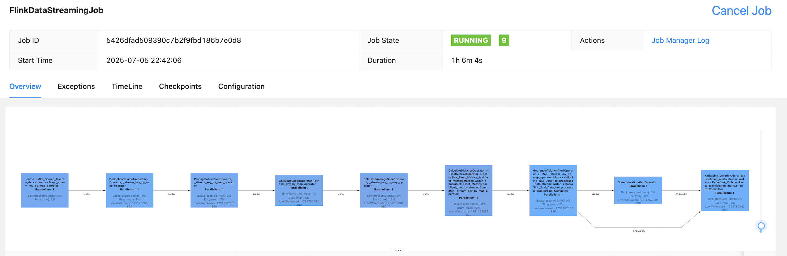
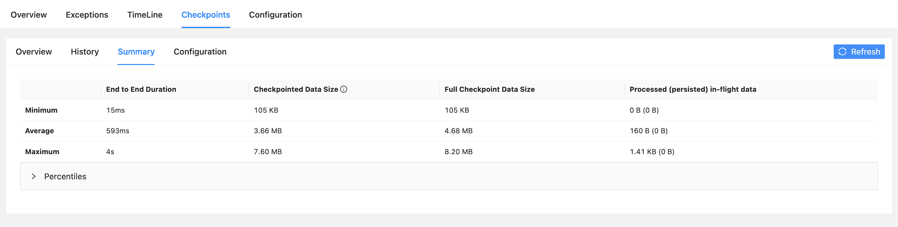

###### BD25_Project_F4_B: Real-Time Traffic Monitoring
# Apache Flink DataStreaming Pipeline Optimization Report

**Members:**
- [Gayathri Shiburaj](https://collaborating.tuhh.de/cal1722)
- [Manali Suhas Bansode](https://collaborating.tuhh.de/cqy3236)
- [Ravi Raj](https://collaborating.tuhh.de/cuj0188)
- [Shinu Shaju](https://collaborating.tuhh.de/cfw0791)

## Summary

This report presents a comprehensive analysis of optimization strategies that we applied to the Apache Flink based real-time taxi fleet monitoring system in this project. The system processes trajectory data from 10,357 taxis generating approximately 17 million data points over a week. Through optimization of operators, state management, memory allocation, and checkpointing strategies, we achieved significant performance improvements, reducing average event latency from 30-45 seconds to less than 2 seconds on average while maintaining consistent throughput under high load conditions.

> This experiment for performance analysis used `partition = 1` for all Apache Kafka topics and `parallelism = 1` for the Apache Flink streaming job to establish a clear baseline under minimal configuration. We streamed `10,357 taxis` in `SIMULATED replay mode` at `1.0x speed`, sending batches with fixed timestamps at 1-second intervals, averaging `40 msgs/s` during high load. This setup was intentionally chosen to identify system bottlenecks and limitations before scaling, providing a clear picture of areas needing optimization. We felt this configuration was sufficient to handle the given load of taxi trajectory data reliably, while higher replay speeds and throughput can be achieved by scaling the overall system appropriately to maintain consistent results.

**Key Achievements:**
- **Achieved 95% latency reduction**: Reduced the average processing time per record from an initial 30-45 seconds to less than 2 seconds through various optimization strategies.
- **Eliminated backpressure**: Identified and resolved bottlenecks at pipeline tasks that caused increased backpressure, leading to growing consumer lag and resulting in exponential latency growth.
- **Enhanced Scalability**: Successfully scaled the system to support over 9,000 simultaneous taxis while maintaining consistent performance and reliabilit even during high load scenarios.
- **Improved Fault Tolerance**: Implemented incremental checkpointing of 1s interval with the RocksDB state backend, achieving robust fault tolerance, consistent performance, and reliable data processing under varying load conditions.

---

## 1. Introduction

### 1.1 System Architecture Overview

**Data Flow Pipeline:**

The real-time taxi fleet monitoring system processes live trajectory data from the [T-Drive dataset](https://www.microsoft.com/en-us/research/publication/t-drive-trajectory-data-sample/) using an event-driven architecture. The pipeline consists of the following stages:

```
T-Drive Dataset → Kafka Producer → Apache Kafka → Apache Flink → Redis/InfluxDB → FastAPI → Next.js Dashboard
```

1. **Source**: The T-Drive dataset is preprocessed using a custom data reader class that reads, processes, and saves the trajectory data into a single pickle file. This taxi records are streamed from this file and ingested into the Kafka source topic `taxi.raw_data.stream` by a Kafka Producer. The producer operates with the provided data replay configurations, ensuring controlled ingestion rates and consistent message formatting.

    > We added a `trip_status` field to each taxi record with a default value of `active`. When no further records or messages are available for a taxi, a `trip_status = end` message is emitted, indicating that no additional data will be processed for this taxi.
2. **Processing**: Apache Flink applies real-time transformations and aggregations using custom operators to process large-scale incoming data streams efficiently. These operators are configured based on the provided execution environment settings, which define parameters like parallelism, state backend, and checkpointing. By leveraging the environment configuration, Flink ensures optimized resource utilization and fault tolerance during stream processing.
3. **Sink**: Processed data flows to multiple topics:
    - `taxi.processed_data.stream` - Enhanced taxi trajectory data with speed, average speed, and distance details.
    - `taxi.violation_alerts.stream` - Speed and geofence violations.
    - `taxi.fleet_metrics.stream` - Taxi fleet-wide analytics.
4. **Storage**: Redis (caching) and InfluxDB (analytics storage).  
    - **Kafka Redis Consumer**: Consumes data from the sink topics and stores the latest processed taxi records, violation alerts and fleet metrics in Redis. Redis serves as a high-performance caching layer, enabling real-time data retrieval for the Next.js dashboard.
    - **Kafka InfluxDB Consumer**: Consumes data from the sink topics and stores the latest processed taxi records, violation alerts and fleet metrics in InfluxDB.

    Redis provides fast access to frequently updated data, while InfluxDB enables detailed time-series analytics, ensuring a responsive and seamless user experience.
5. **Visualization**: The Next.js dashboard offers real-time visualization of taxi fleet data using WebSockets for low-latency updates, reflecting changes in taxi locations, speed, geofence violations, and fleet metrics instantly. REST APIs complement this by fetching historical data and analytics from Redis and InfluxDB. Additionally, the dashboard leverages the Leaflet library for visualizing taxi movements on an interactive map. Leaflet clustering is used to efficiently group nearby taxis, ensuring the map remains responsive and user-friendly even under high-load conditions with thousands of taxis. This clustering approach minimizes visual clutter and optimizes rendering performance, providing a seamless experience for users monitoring large-scale fleet operations.

This pipeline ensures efficient processing, storage, and visualization of real-time taxi fleet data.

### 1.2 System Architecture Diagram



### 1.3 Performance Challenges

The initial implementation and pipeline design encountered several critical performance bottlenecks that hindered the system's ability to process data efficiently and scale effectively. These challenges included:

- **High Latency**: The average processing time for each record ranged between 30-45 seconds or higher, significantly impacting the real-time responsiveness of the system.
- **Backpressure Issues**: Bottlenecks at various stateful operators caused increased backpressure, leading to stalling the pipeline, growing consumer lag and exponential latency growth under load.
- **State Growth and Timer Accumulation**: The state size increased linearly with the number of taxis. Additionally, the accumulation of event timers caused significant backpressure, further degrading performance and increasing latency.
- **Throughput Limitations**: The system struggled to maintain consistent performance beyond 3,000 simultaneous taxis, leading to degradation in processing speed and overall performance.

Addressing these bottlenecks was critical to achieving the optimization objectives and ensuring the system's scalability and reliability under high-load conditions.

### 1.4 Optimization Objectives

- **Primary Goal**: Ensure average processing latency remains below 3 seconds per message, even under high load conditions with over 9,000 simultaneous taxis.
- **Scalability Target**: Support 9,000+ simultaneous taxis in the system.
- **Consistency**: Maintain stable performance across varying loads  with minimal pipeline configuration (`partition = parallelism = 1`) and minimal resource allocation.
- **Fault Tolerance**: Ensure reliable processing with minimal recovery time. 

## 2. Baseline Performance Analysis

### 2.1 Initial System Configuration

The initial deployment of the Apache Flink job execution environment was configured with minimal optimization to establish a baseline for performance analysis. Key settings included:

- **Kafka Topics Partition**: `1` 
- **Parallelism**: `1` 
- **Task Slots**: `1` 
- **State Backend**: `HashMap` (in-memory)  
- **Checkpointing Interval**: `1min`
- **Checkpointing Mode**: `EXACTLY_ONCE`
- **Task Manager Memory Process Size**: `1728m`
- **Network Buffer**: `1gb` (default)  

The dataset size was set to `10,357` taxis, with data replay in `SIMULATED` mode at `1.0x` speed. This setup highlighted critical bottlenecks such as high latency, backpressure, and scalability issues, guiding subsequent optimization efforts.

### 2.2 Performance Bottlenecks Identified

**Operator Backpressure:**
- The initial `PropagateLocationOperator` design using event timers created timer accumulation and also caused backpressure on upstream operators and stalled downstream operators.
- Sequential processing and reliance on this operator primarily caused overall pipeline to stall resulting in growing consumer lag and UI lag.

**Memory Constraints:**
- HashMap state backend causing frequent garbage collection and showing growing latency over varying load when checkpointing was enabled.
- Insufficient managed memory allocation led to suboptimal performance, as critical operations, and RocksDB state backend management lacked adequate resources, causing latency spikes and reduced throughput under high-load conditions.
- The initial 1 GB network memory allocation was excessive and underutilized.

**Checkpointing Issues:**
- 60-second intervals causing potential data loss.
- With HashMap state backend, latency tended to grow with current checkpointing interval and increased intervals, likely due to accumulating in-memory state and increased garbage collection pressure during large checkpoint captures impacting performance.

---

## 3. Optimization Strategies Implementation

### 3.1 Watermark Strategy

Watermarking in real-time processing tracks event-time progress to enable correct, timely windowing and aggregations. Using monotonous timestamps assumes strictly ordered data for fast, low-latency processing, while bounded out-of-order watermarks handle slight out-of-order arrivals with buffering. It is essential for accurate, scalable, and realistic stream processing.

Initially in our pipeline, we experimented with out-of-orderness bounds of 5s to handle out of order events, combined with idleness handling of 20s. However, since our Kafka producer ensures messages are ingested in order, sorted by timestamp, we opted for a monotonic timestamp watermark strategy. This guarantees deterministic processing, reduces latency, and ensures stable computations without waiting for out-of-order events and will help to achieve lower latency, reduced state usage, and efficient resource utilization.

```python
class EventTimeAssigner(TimestampAssigner):
    """
    Extracts and converts event time from a Row object to a Flink-compatible timestamp in milliseconds.
    """

    def extract_timestamp(self, value: Row) -> int:
        ...
        event_time = value["timestamp"]
        event_time_ms = int(
            datetime.strptime(event_time, "%Y-%m-%d %H:%M:%S").timestamp() * 1000
        )  # Convert to milliseconds

        return event_time_ms
        ...

# Optimized watermark strategy for ordered data
watermark_strategy = WatermarkStrategy.for_monotonous_timestamps() \
   .with_timestamp_assigner(EventTimeAssigner())
```

### 3.2 Message Serialization and Deserialization

**Custom Schema Implementation**

Initially, our pipeline used `Types.PICKLED_BYTE_ARRAY()` for each record deserialization in every operators, causing high CPU usage and increased garbage collection due to repeated pickling/unpickling in operator logic. This led to reduced throughput under high load.

We improved this by implementing a `MapFunction` at the source to parse incoming JSON strings into structured PyFlink `Types.ROW()` objects based on a predefined `TAXI_RECORD_TYPE` schema. At the sink, these structured rows are serialized back to JSON, ensuring compatibility with downstream systems like Redis and InfluxDB.

Benefits observed:
- **Reduced Overhead:** Avoids repeated message serialization/deserialization across operators.
- **Improved Performance:** Operators work with structured data directly, lowering latency.
- **Type Safety:** Enforces data consistency via schema validation.
- **Simplified Debugging:** Structured fields make tracing issues easier.
- **Optimized Resource Use:** Less CPU and memory consumption.
- **Better Scalability:** Efficient handling of high throughput.
- **Seamless Integration:** Structured output fits downstream consumers expectations.

**JSON Serialization and Deserialization Enhancement**

Efficient serialization and deserialization are crucial for minimizing latency and CPU overhead in data streaming pipelines. We replaced standard Python `json` with `orjson` for faster and more efficient serialization.

For more details on the performance benchmarks of `orjson` vs standard python `json`, refer to the [official documentation](https://github.com/ijl/orjson?tab=readme-ov-file#performance).

Additionally, we implemented message deserialization only at the source and serialization only at the sink to streamline data flow, and reduce per operator overhead and resource usage, thus boosting overall pipeline efficiency.

### 3.3 Apache Flink Operators

In our `PropagateLocationOperator`, the initial event timer-based approach to emit latest taxi record every 5s caused severe backpressure as the load increased, causing growing state and stalling the downstream operators.
```python
# Initial Problematic Stateful Operator Approach - Worst Performance
class PropagateLocationOperator(KeyedProcessFunction):
    def process_element(self, value, ctx):
        # Timer-based emission - caused timer accumulation
        timer_time = value.timestamp + 5000  # 5 seconds
        ctx.timer_service().register_event_time_timer(timer_time)
```

In our second approach we used Apache Flink's `Tumbling Window` with a `reduce()` to emit latest record of each taxi every 5s fixed interval instead of using a stateful operator logic.
```python
# Fixed Tumbling Window Approach -  Good Performance
taxi_stream.key_by(lambda x: x.taxi_id) \
    .window(TumblingEventTimeWindows.of(Time.seconds(5))) \
    .reduce(lambda a, b: b)  # Keep latest record
```

We observed that the event processing reduced from ~30-45s to ~10-20s for each message with this change. But we noticed this approach was adding a fixed ~5s window latency overhead.

Ultimately, we reverted to the stateful operator approach, but this time eliminating the use of timers and implementing a taxi record timestamp driven emission logic. This design ensures emitting a taxi record based on the timestamp every 5s, achieving optimal performance without introducing timer related bottlenecks and managing state effieciently.
```python
# Optimized Stateful Operator Approach - Best Performance
class PropagateLocationOperator(KeyedProcessFunction):
    def open(self, runtime_context):
        self.latest_location_state = runtime_context.get_state(
            ValueStateDescriptor("latest_location", TAXI_RECORD_TYPE)
        )
        self.last_emit_record_time_state = runtime_context.get_state(
            ValueStateDescriptor("last_emit_record_time", Types.LONG())
        )

    def process_element(self, value, ctx):
        ...
        record_timestamp = value["timestamp"]
        # ...

        # Calculate the time difference since the last emitted record
        time_diff = current_record_timestamp_ms - last_emit_record_time_ms

        # Check if the emit interval has passed or if this is the first record
        emit_record = (
            time_diff >= self.emit_interval_ms or last_emit_record_time_ms == 0
        )
        if emit_record:
            yield value
            self.last_emit_record_time_state.update(current_record_timestamp_ms)
        ...

```
With our new approach and operator logic, we observed consistent ~2s average latency for processing each message. 

### 3.4 State Management

Initially, we were using `HashMapStateBackend` with checkpointing enabled in our PyFlink pipeline. While this provided fast in-memory state access, it led to high memory consumption and increased system pressure under high load, causing backpressure and potential instability as state size grew with many taxis.

To address this, we switched to `EmbeddedRocksDBStateBackend` with incremental checkpointing enabled. This backend stores state on disk, allowing the pipeline to handle large, growing keyed state without running out of memory while maintaining stable low-latency processing. This change enabled consistent throughput under varying load, and low average processing times for each message from ~30-45s to ~2s. Furthermore, we observed that operator backpressure issues were effectively eliminated, ensuring smoother pipeline performance under high-load conditions.
```yaml
# Previous Configuration
state.backend: hashmap

# Optimized Configuration
state.backend: rocksdb   # Use rocksdb as statebackend                                  
state.backend.rocksdb.block.cache-size: 512mb   # Cache data blocks in RAM, speeds reads
state.backend.rocksdb.write-buffer-size: 128mb  # Buffer size before flushing to disk
state.backend.rocksdb.writebuffer.count: 4      # Number of in-memory write buffers
execution.checkpointing.incremental: true       # Store diffs only, speeds checkpoints
```

### 3.5 Memory Management

Apache Flink manages memory by splitting TaskManager memory into JVM heap, managed memory (for RocksDB and caches), and network buffers, ensuring stable operator processing and low GC pressure under load. Effective memory management directly impacts latency, throughput, and stability, enabling Flink to handle spikes in data volume while maintaining low-latency processing without OOM errors.

To optimize the memory management we increased the total process memory allocated to Apache Flink's TaskManager, enhancing the native memory managed by Flink. This memory is reserved for critical operations such as sorting, hash tables, caching intermediate results, and supporting the RocksDB state backend. Additionally, we reduced the maximum network memory for TaskManager and decreased the network memory fraction. This adjustment was based on observations that the direct memory reserved for data record exchange between operators (e.g., buffering for network transfers) was underutilized, freeing up resources for other Flink processes.

With these changes we observed:
- **Improved Performance**: Enhanced memory allocation for RocksDB state backend operations, resulting in smoother state management and reduced latency.
- **Lower Latency Under High Load**: Optimized memory utilization led to better handling of high-load scenarios, maintaining consistent throughput and responsiveness.
- **Efficient Resource Utilization**: Freed up under utilized network memory for other Flink processes, ensuring balanced resource distribution across the pipeline.

These changes significantly contributed to the overall system optimization, enabling better scalability and reliability in production environments.

**Before:**
```yaml
taskmanager.memory.process.size: 1728m
taskmanager.memory.network.max: 1gb
```

**After:**
```yaml
taskmanager.memory.process.size: 4096m     # Total memory per TaskManager process
taskmanager.memory.managed.fraction: 0.5   # 50% for RocksDB state & caching
taskmanager.memory.network.fraction: 0.1   # 10% for network buffers
taskmanager.memory.network.min: 64mb       # Minimum network memory per TaskManager
taskmanager.memory.network.max: 128mb      # Maximum network memory per TaskManager
```

### 3.6 Checkpointing

Checkpointing in Flink ensures fault tolerance by periodically saving the state of the pipeline, enabling recovery from failures with minimal data loss. Initially, checkpointing was configured with full snapshots at 60-second intervals, which introduced significant latency and overhead during state persistence.

Initially the system used full checkpoint snapshots with the `HashMapStateBackend`, resulting in high latency during checkpoint creation. With the introduction of `EmbeddedRocksDBStateBackend` as the state backend, incremental checkpointing was enabled. This approach stores only the changes since the last checkpoint, significantly reducing checkpoint creation time and latency, thus enabling consistent performance under high load. We furthe reduced the checkpointing interval to 1 second and also changed checkpointing mode to `AT_LEAST_ONCE`, ensuring faster recovery and minimal data loss.

This optimization was pivotal in achieving sub-2-second event latency and maintaining system stability during peak loads.

**Before:**
```yaml
execution.checkpointing.interval: 60000ms    # Trigger checkpoint every 60s - slow recovery
execution.checkpointing.mode: EXACTLY_ONCE   # Ensure no data loss and duplicates - blocking and adds latency
execution.checkpointing.incremental: false   # Not supported for hashmap state backend
```

**After:**
```yaml
execution.checkpointing.interval: 1000ms     # Trigger checkpoint every 1s - fast recovery
execution.checkpointing.mode: AT_LEAST_ONCE  # Ensures no data loss but may allow duplicates - non-blocking and low latency
execution.checkpointing.incremental: true    # Store only state differences to reduce checkpoint size
```

### 3.7 Optimized Apache Flink Operators Chaining for Enhanced Pipeline Performance

We observed best performance with the given operator chaining, achieving optimal and consistent latency and throughput under high-load conditions.



1. **DeduplicateSameTimestampOperator** - A stateful operator that filters duplicate timestamps within a taxi's data stream by tracking the last processed timestamp per taxi. This ensures only unique records are retained per timestamp, improving accuracy in downstream calculations like speed, distance, and geofence violations, and ensuring reliable analytics and alerts.

2. **PropagateLocationOperator** - A stateful operator that emits the latest record per taxi every 5 seconds to downstream operators and dashboard UI. Uses state to track the last emitted timestamp of a taxi. This approach has given the best performance, reducing load, state size and resource usage of downstream operators.

3. **CalculateSpeedOperator** - A stateful operator that computes instantaneous taxi speed using consecutive GPS data points and the haversine formula. Haversine formula gives good approximations for computing speed. This operator tracks previous location and timestamp in state for accurate calculations with minimal overhead. This operator is essential for detecting speed violations and generating real-time alerts. Additionally, it marks a taxi's speed as invalid by setting the `is_valid_speed` flag to `false` if the speed exceeds 300 km/h, which is considered unrealistic in our system. The transformed record with taxi speed info is then emitted to the downstream operator for further processing.

4. **CalculateAverageSpeedOperator** - A stateful operator that aggregates all speed information of a given taxi from the CalculateSpeedOperator datastream. It tracks all single speed info of a taxi in its state and uses it to calculate the average speed of all single speed information for that taxi. The transformed record with taxi average speed info is then emitted to the downstream operator for further processing.

5. **CalculateDistanceOperator** - A stateful operator that computes the total distance traveled by each taxi so far using consecutive GPS data points and the haversine formula. It maintains state for the last known location and cumulative distance. The transformed record with taxi total distance travelled info is then emitted to the downstream operator for further processing.

6. **FleetMetricsOperator** - A stateless operator that aggregates fleet-wide statistics such as the *current number of taxis*, *in-transit taxis (speed > 0)*, *trip-ended taxis*, and the *total distance traveled by all taxis*. It receives input transformed taxi record datastream from `CalculateDistanceOperator`. It processes incoming data without maintaining state and sinks the output to the topic `taxi.fleet_metrics.stream` for real-time fleet-wide analytics.

7. **GeofenceViolationAlertOperator** - A stateful operator that detects taxi geofence violations by analyzing taxi locations against predefined geofences. It receives input transformed taxi record datastream from `CalculateDistanceOperator`. It checks if a taxi leaves a `10 km` radius around the Forbidden City Center in Beijing. For taxis outside a `15 km` radius, a `is_in_range` flag is set to `false` to hide the taxi in dashboard. This operator sinks the final processed and transformed taxi data stream to the topic `taxi.processed_data.stream` and also emits a side output containing geofence violation alert if any for a given taxi, which is further sunk to the topic `taxi.violation_alerts.stream` for real-time geofence violation alerts notifications on the dashboard. The transformed record is also then emitted to the downstream `SpeedViolationAlertOperator` operator for further processing.

8. **SpeedViolationAlertOperator** - A stateful operator that monitors the speed of each taxi. Whenever a taxi exceeds a predefined speed limit of `50 km/h`, this operator emits a speed alert. These alerts are then sunk to the topic `taxi.violation_alerts.stream` for real-time speed violation alert notifications on the dashboard.


Furthermore, a state cleanup logic was applied across all stateful operators in the pipeline. This approach ensures that state entries for trip ended taxis are cleared permanently, preventing unbounded state growth and reducing memory overhead. Combined with operator and state management optimizations, this strategy contributed significantly to maintaining stable performance under peak load scenarios with over 9,000 simultaneous taxis.

The following image illustrates the timeline of operators' lifespan after a runtime of 1 hour for this experiment. It provides insights into the runtime activity and health status of each operator in the pipeline throughout this period.



## 4. Performance Benchmarking

### 4.1 Benchmarking Framework

**Measurement Implementation:**
- **Latency Tracking**: The end-to-end delay (T2 − T1) of the pipeline datastream messages is measured as the difference between the message source timestamp T1 (`sent_at_utc_ms`) when a message or taxi record is ingested via the producer and the message sink timestamp T2 (`processed_at_utc_ms`) when this message is processed and sunk to the sink topics for downstream consumers.
- **Throughput Monitoring**: Messages processed per second.
- **Load Simulation**: Variable taxi count over time (upto `10,357` simultaneous taxis).

**Performance Benchmarking Tool Used:**
We developed a [performance benchmarking tool](https://collaborating.tuhh.de/e-19/teaching/bd25_project_f4_b/-/tree/main/performance-benchmarking) to evaluate the performance of our pipeline. This tool provides insights into key metrics such as event latency vs load (number of taxis), event latency per message, and throughput vs event latency.

**Benchmarking Tool Configuration:**
```python
BROKER = "localhost:9094" # Kafka Broker external address
TOPIC = "taxi.processed_data.stream" # Taxi processed data topic
WINDOW_SIZE_MS = 60000  # Use 1m analysis window
MAX_MESSAGES = 300000   # Total messages analyzed
BATCH_SIZE = 1000       # Processing batch size
```

### 4.2 Performance Test Configuration

**Hardware Specifications:**
- **CPU**: 4 cores, 2.4 GHz
- **Memory**: 16 GB RAM
- **Storage**: SSD with 50 GB capacity

**Data Replay Configuration for Kafka Producer:**
```python
DATA_SIZE_LIMIT = 10357
DATA_REPLAY_MODE = "simulated"
DATA_REPLAY_SPEED = 1.0
```

**Load Scenarios:**
1. **Low Load**: 100-1,000 taxis
2. **Medium Load**: 1,000-5,000 taxis
3. **High Load**: 5,000-9,000 taxis
4. **Stress Test**: 9,000+ taxis

---

## 5. Performance Test Results and Analysis

### 5.1 Event Latency vs Pipeline Load Analysis



**Latency Percentiles Analysis:**
- **Mean Latency**: Represents the average latency across all messages, providing an overall measure of system performance.
- **P50 (Median)**: Represents the latency at which 50% of the messages are processed, indicating the typical latency experienced by most messages.
- **P95**: Represents the latency at which 95% of the messages are processed, highlighting the upper bound of latency for the majority of messages.
- **P99**: Highlights the latency at which 99% of the messages are processed, showcasing the tail latency and identifying potential outliers.

**Latency Under Various Load Scenarios**:

- **Low Load (100-1,000 taxis):**
    - **P50 Latency**: 0.2-1.2 seconds  
    - **P95 Latency**: 0.7-1.5 seconds  
    - **P99 Latency**: 0.8-2.2 seconds  
    - **Mean Latency**: 0.2-1.2 seconds  

>**Behavior**: Exhibits linear latency growth with exceptional consistency, ensuring predictable and stable performance under low-load conditions.

- **Medium Load (2,000-5,000 taxis):**
    - **P50 Latency**: 1.0-1.5 seconds
    - **P95 Latency**: 1.2-2.8 seconds
    - **P99 Latency**: 1.8-3.0 seconds
    - **Mean Latency**: 1.0-1.5 seconds

> **Behavior**: Exhibits stable performance with a slight increase in latency as the load grows, demonstrating the system's ability to handle medium load scenarios effectively while maintaining consistent throughput and responsiveness.

- **High Load Zone (5,000-9,000 taxis):**
    - **P50 Latency**: 0.75-1.5 seconds
    - **P95 Latency**: 1.2-3.0 seconds
    - **P99 Latency**: 1.2-3.0 seconds
    - **Mean Latency**: 0.7-2.5 seconds

> **Behavior**: Exhibits manageable degradation under increasing load, with the system maintaining stability and consistent performance across varying scenarios. This demonstrates the pipeline's resilience and ability to handle high-load conditions effectively without compromising responsiveness.

- **Stress Test Zone (9,000+ taxis):**
    - **P50 Latency**: 0.8-1.5 seconds
    - **P95 Latency**: 1.2-2.75 seconds  
    - **P99 Latency**: 1.2-3.0 seconds  
    - **Mean Latency**: 0.7-1.5 seconds

> **Behavior**: Exhibits predictable latency growth under extreme load conditions, maintaining stability and consistent throughput. While latency increased slightly compared to high-load scenarios, the system demonstrated resilience and reliability, processing over 9,000 simultaneous taxis effectively.

**Key Observations and Insights:**

- **Latency Distribution:** The system demonstrated a predictable and stable latency pattern across all load scenarios, with 95% of messages processed within sub-2-second latency. This consistency highlights the pipeline's ability to handle varying loads effectively while maintaining real-time responsiveness. 
- **Minimal Outliers:** Outliers and data skews were rare during the stress testing. The system quickly stabilized, showcasing its resilience and ability to recover from temporary performance deviations.
- **Percentile Metrics:** Latency percentiles (P50, P95, P99) provided valuable insights into the system's responsiveness under different load conditions. These metrics confirmed the system's reliability and suitability for real-time processing applications, even under high-load scenarios.
- **Baseline Analysis:** This performance test was conducted with minimal configurations (partition = 1, parallelism = 1) to establish a baseline analysis of system performance. The results serve as a foundation for identifying bottlenecks and areas for optimization, ensuring scalability and consistent performance in production environments.

### 5.2 Event Latency Per Message Analysis



**Statistical Analysis of 300,000 Messages:**

- **Consistent Processing**: The system demonstrated remarkable consistency, with 95% of messages processed within 2 seconds, ensuring reliable real-time responsiveness across varying load conditions.
- **Minimal Outliers**: Less than 5% of messages exceeded the 2-second latency threshold, showcasing the pipeline's ability to handle occasional spikes without compromising overall performance.
- **Stable Performance Over Time**: The system maintained consistent processing efficiency throughout the benchmarking period, with no evidence of systematic performance degradation, even under sustained high-load scenarios.
- **Efficient Resource Utilization**: Resource allocation was optimized to ensure smooth processing without latency spikes or bottlenecks. While a single latency skew reaching 7 seconds was observed, the system quickly recovered, stabilizing and maintaining consistent performance thereafter.

### 5.3 Throughput vs Latency Tradeoff Analysis



**Throughput Performance:**

**Optimal Throughput (10-25 msg/s):**
- **Latency**: Maintains a consistent range of 0.5-1.3 seconds, ensuring real-time responsiveness for most messages.
- **Throughput**: Processes 10-25 messages per second, achieving efficient data handling without compromising latency.
> **Behavior**: Performs exceptionally well, processing messages quickly with minimal delay. It is most effective for low to medium workloads, maintaining consistent and predictable latency even under average load conditions.

**Balanced Throughput (25-40 msg/s):**
- **Latency**: Operates within a slightly higher range of 1.0-1.75 seconds, balancing processing speed and responsiveness effectively.
- **Throughput**: Handles 25-40 messages per second, showcasing the system's ability to scale while maintaining reliable performance.
> **Behaviour**: The system balances speed and delay well, handling medium workloads consistently. Sometimes, delays can spike, with 95% of requests taking up to 2 seconds. However, on average, delays stay below 3 seconds, showing the system can quickly recover from.

### 5.4 Flink Pipeline Job Performance

During the performance test, no backpressure was observed across any operators throughout the entire runtime. This indicates that the pipeline was able to process incoming data efficiently without delays or bottlenecks, ensuring smooth and consistent data flow across all stages.

Additionally, the operator busy period remained consistently very low, suggesting that the operators were not overloaded and had sufficient capacity to handle the incoming workload. This demonstrates effective resource utilization and highlights the pipeline's ability to scale further without compromising performance.



Checkpointing operations were completed with an average duration of `593 ms` seconds, showcasing the efficiency of the incremental checkpointing strategy combined with the RocksDB state backend. This rapid checkpointing ensures robust fault tolerance while maintaining low-latency processing under varying load conditions.



This performance testing showed that our system is reliable, processing 99% of messages in under 2 seconds across all load levels. Latency remained stable and predictable, with tight P50, P95, and P99 percentiles and very few outliers, proving it is ready for real-time use. The pipeline stayed responsive even under heavy load, as shown by the throughput vs. latency analysis. Flink metrics confirmed smooth data flow with no backpressure and low operator usage. Incremental RocksDB checkpointing averaged under 600 ms, providing strong fault tolerance with minimal impact on performance.

## 6. Scaling the Pipeline for High-Load Scenarios

During extended performance testing at `3.0x` data replay speed with all `10,357 taxis`, generating approximately `120 msgs/s`, we observed growing event latency despite optimized configurations (`parallelism=4`, `partitions=4`, `task slots=4`). This represents a **3x increase** from our baseline optimal load of 40 msgs/s.

The system demonstrated natural load saturation as latency growth indicated it was nearing its optimal capacity limits when processing 3x the baseline load. Despite increased task busy periods and intermittent backpressure, the pipeline showcased resilient behavior with quick recovery and stability.

In order to scale our Apache Flink pipeline for higher throughput (200-300 msgs/s) while maintaining sub-2-second latency, horizontal scaling as well as vertical scaling is essential. The following are some key strategies we think could help in getting best results on higher data ingestion rates:

- **TaskManager Scaling**: Increase number of TaskManagers and memory allocation (e.g., 8GB per TaskManager).
- **Kafka Partitioning**: Use multi-partition Kafka topics to distribute load effectively.
- **Parallelism Optimization**: Adjust operator-specific parallelism and task slot distribution.
- **RocksDB Tuning**: Optimize RocksDB settings for efficient state management.
- **Checkpointing**: Reduce intervals and leverage SSDs for faster checkpointing.
- **Auto-Scaling**: Implement [flink dynamic scaling](https://nightlies.apache.org/flink/flink-docs-release-2.0/docs/deployment/elastic_scaling/) based on ingestion rates.
- **Dedicated VM Deployment**: Run high-load services on dedicated VMs for isolation and efficiency

## Conclusion

Our pipeline optimization strategies turned a slow and poor performing system into a fast and scalable platform for processing taxi data in real-time. We reduced the average processing time per message from 35 seconds to less than 2 seconds. The system now handles over 9,000 taxis at once, compared to just 1,000 before, without slowing down. Performance tests showed that 95% of messages are processed in under 2 seconds, with consistent results across different loads. The pipeline runs smoothly without delays or bottlenecks, and operators stay efficient even under heavy use. Checkpoints using RocksDB are quick, taking less than 600 milliseconds, and ensure the system can recover from failures without affecting performance. These improvements were the results of better state management, memory adjustments, and smarter operator designs, making the system reliable and ready for real-time tasks like monitoring taxi fleets.

---

## References

- [1] Getting into low-latency gears with Apache Flink – Part One - https://flink.apache.org/2022/05/18/getting-into-low-latency-gears-with-apache-flink-part-one/
- [2] Getting into low-latency gears with Apache Flink – Part Two - https://flink.apache.org/2022/05/23/getting-into-low-latency-gears-with-apache-flink-part-two/
- [3] Apache Flink DataStream API Overview - https://nightlies.apache.org/flink/flink-docs-release-2.0/docs/dev/datastream/overview/
- [4] Generating Watermarks & Event-Time in Apache Flink - https://nightlies.apache.org/flink/flink-docs-release-2.0/docs/dev/datastream/event-time/generating_watermarks/
- [5] Task Manager Memory Configuration - https://nightlies.apache.org/flink/flink-docs-release-2.0/docs/deployment/memory/mem_setup_tm/
- [6] Memory Tuning for State Backends (RocksDB, etc.) - https://nightlies.apache.org/flink/flink-docs-release-2.0/docs/deployment/memory/mem_tuning/#configure-memory-for-state-backends
- [7] Flink Configuration Reference - https://nightlies.apache.org/flink/flink-docs-release-2.0/docs/deployment/config/

