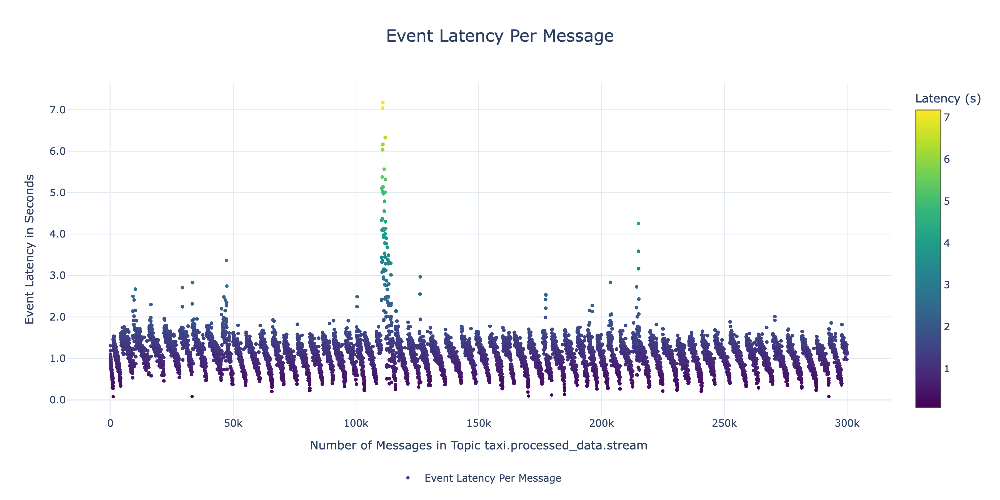

# Kafka Pipeline Performance Benchmarking Tool

A performance analysis tool for evaluating Kafka streaming pipeline with latency, throughput, and scalability metrics for this project.

## What It Does

This tool provides detailed performance insights into Kafka streaming pipeline through the following analyses:

- **Event Latency vs Pipeline Load (Number of Taxis) Analysis**: Evaluates latency percentiles (P50, P95, P99) under varying pipeline loads, identifying performance zones and degradation points as the number of taxis increases.

  
- **Event Latency Per Message Analysis**: Offers granular insights into the latency of individual messages, enabling detection of bottlenecks and opportunities for optimizing processing times.

  
- **Throughput vs Latency Trade-off Analysis**: Measures the number of messages processed per second, showcasing the trade-offs between throughput and latency under different load conditions.

  
- **Load Testing**: Simulates pipeline performance under varying taxi loads to assess scalability and stability.

- **Visual Reports**: Generates professional charts (HTML and PNG formats) for easy interpretation and sharing of results, aiding in decision-making and performance optimization.

## Quick Setup

### 1. Install Dependencies
```bash
cd performance-benchmarking
python3 -m venv venv
source venv/bin/activate
pip install -r requirements.txt
```

### 2. Configure Kafka Connection
Edit `benchmarking.py` if needed:
```python
BROKER = "localhost:9094"  # Your Kafka broker
TOPIC = "taxi.processed_data.stream"  # Your topic
WINDOW_SIZE_MS = 60000  # Analysis window size in milliseconds
MAX_MESSAGES = 250000  # Maximum number of messages to analyze
BATCH_SIZE = 1000  # Number of messages processed in each batch
```

### 3. Run the Script
```bash
python3 benchmarking.py
```

## View Results

### Generated Files:
- **`results/`** folder with interactive charts and images:
    - `event_latency_vs_load_chart.html` - Event Latency vs Load analysis (HTML format)
    - `throughput_vs_event_latency_chart.html` - Performance trade-offs (HTML format)
    - `event_latency_per_message_chart.html` - Individual message latencies (HTML format)
    - `event_latency_vs_load_chart.png` - Event Latency vs Load analysis (image format)
    - `throughput_vs_event_latency_chart.png` - Performance trade-offs (image format)
    - `event_latency_per_message_chart.png` - Individual message latencies (image format)
- **`performance_benchmark_results.json`** - Raw analysis data

